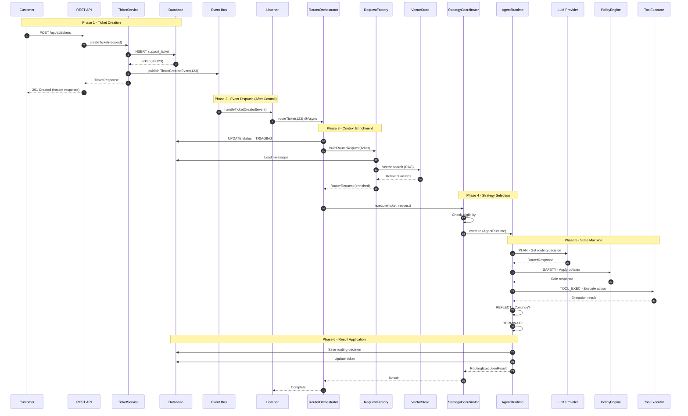

# 03 - Routing Flow

> End-to-end walkthrough of the ticket routing process with sequence diagrams.

---

## Table of Contents

1. [Flow Overview](#1-flow-overview)
2. [Sequence Diagram](#2-sequence-diagram)
3. [Phase 1: Ticket Creation](#3-phase-1-ticket-creation)
4. [Phase 2: Event Dispatch](#4-phase-2-event-dispatch)
5. [Phase 3: Context Enrichment](#5-phase-3-context-enrichment)
6. [Phase 4: Strategy Selection](#6-phase-4-strategy-selection)
7. [Phase 5: State Machine Execution](#7-phase-5-state-machine-execution)
8. [Phase 6: Result Application](#8-phase-6-result-application)
9. [RAG Flow Deep Dive](#9-rag-flow-deep-dive)
10. [Flow Variations](#10-flow-variations)

---

## 1. Flow Overview

### High-Level Phases

```
┌─────────────────────────────────────────────────────────────────────────┐
│                         TICKET ROUTING FLOW                             │
├─────────────────────────────────────────────────────────────────────────┤
│                                                                         │
│   Phase 1: CREATION                                                     │
│   ┌─────────────────┐                                                   │
│   │ Customer        │  → Submit ticket → Status: RECEIVED               │
│   └─────────────────┘                                                   │
│                                                                         │
│   Phase 2: EVENT DISPATCH                                               │
│   ┌─────────────────┐                                                   │
│   │ Spring Events   │  → TicketCreatedEvent → AFTER_COMMIT              │
│   └─────────────────┘                                                   │
│                                                                         │
│   Phase 3: CONTEXT ENRICHMENT                                           │
│   ┌─────────────────┐                                                   │
│   │ RAG + Metadata  │  → Load messages, articles, patterns, customer    │
│   └─────────────────┘                                                   │
│                                                                         │
│   Phase 4: STRATEGY SELECTION                                           │
│   ┌─────────────────┐                                                   │
│   │ Strategy Pattern │ → AgentRuntime vs Classic                        │
│   └─────────────────┘                                                   │
│                                                                         │
│   Phase 5: STATE MACHINE                                                │
│   ┌─────────────────┐                                                   │
│   │ LangGraph4j     │  → PLAN → SAFETY → TOOL_EXEC → REFLECT            │
│   └─────────────────┘                                                   │
│                                                                         │
│   Phase 6: RESULT APPLICATION                                           │
│   ┌─────────────────┐                                                   │
│   │ Persist + Notify │ → Save routing, update ticket, send SSE          │
│   └─────────────────┘                                                   │
│                                                                         │
└─────────────────────────────────────────────────────────────────────────┘
```

---

## 2. Sequence Diagram



---

## 3. Phase 1: Ticket Creation

### What Happens

```
┌─────────────────────────────────────────────────────────────────┐
│                                                                 │
│   Customer submits ticket                                       │
│   ┌─────────────────────────────────────────────────────────┐   │
│   │ POST /api/v1/tickets                                    │   │
│   │ {                                                       │   │
│   │   "subject": "Cannot login to my account",              │   │
│   │   "message": "I've tried multiple times..."             │   │
│   │ }                                                       │   │
│   └─────────────────────────────────────────────────────────┘   │
│                                │                                │
│                                ▼                                │
│   ┌─────────────────────────────────────────────────────────┐   │
│   │ TicketCreationWorkflowService                           │   │
│   │                                                         │   │
│   │  1. Validate request                                    │   │
│   │  2. Create SupportTicket entity                         │   │
│   │  3. Set initial status = RECEIVED                       │   │
│   │  4. Create first TicketMessage                          │   │
│   │  5. Persist to database                                 │   │
│   │  6. Publish TicketCreatedEvent                          │   │
│   │  7. Return response                                     │   │
│   └─────────────────────────────────────────────────────────┘   │
│                                │                                │
│                                ▼                                │
│   ┌─────────────────────────────────────────────────────────┐   │
│   │ Response (instant, no routing yet)                      │   │
│   │ {                                                       │   │
│   │   "id": 123,                                            │   │
│   │   "ticketNo": "TKT-2024-0123",                          │   │
│   │   "status": "RECEIVED",                                 │   │
│   │   "message": "Ticket created successfully"              │   │
│   │ }                                                       │   │
│   └─────────────────────────────────────────────────────────┘   │
│                                                                 │
└─────────────────────────────────────────────────────────────────┘
```

### Key Points

| Aspect          | Detail                            |
|-----------------|-----------------------------------|
| **Status**      | Starts as `RECEIVED`              |
| **Response**    | Immediate, no waiting for routing |
| **Event**       | Published but not yet processed   |
| **Transaction** | Commits after response sent       |

---

## 4. Phase 2: Event Dispatch

### What Happens

```
┌─────────────────────────────────────────────────────────────────┐
│                                                                 │
│   Spring Event Processing                                       │
│                                                                 │
│   [Thread: HTTP Request]                                        │
│   ┌─────────────────────────────────────────────────────────┐   │
│   │ Transaction commits                                     │   │
│   │                                                         │   │
│   │ Spring checks for @TransactionalEventListener           │   │
│   │ with phase = AFTER_COMMIT                               │   │
│   │                                                         │   │
│   │ ┌─────────────────────────────────────────────────────┐ │   │
│   │ │ TicketRoutingListener.handleTicketCreated()         │ │   │
│   │ │                                                     │ │   │
│   │ │ @TransactionalEventListener(phase=AFTER_COMMIT)     │ │   │
│   │ │                                                     │ │   │
│   │ │ → Invoked ONLY after DB commit succeeds             │ │   │
│   │ └─────────────────────────────────────────────────────┘ │   │
│   └─────────────────────────────────────────────────────────┘   │
│                                │                                │
│                                │ @Async (different thread)      │
│                                ▼                                │
│   [Thread: routing-pool-1]                                      │
│   ┌─────────────────────────────────────────────────────────┐   │
│   │ routerOrchestrator.routeTicket(123)                     │   │
│   │                                                         │   │
│   │ Starts new transaction (REQUIRES_NEW)                   │   │
│   └─────────────────────────────────────────────────────────┘   │
│                                                                 │
└─────────────────────────────────────────────────────────────────┘
```

### Why This Design?

```
┌─────────────────────────────────────────────────────────────────┐
│                         DESIGN RATIONALE                        │
├─────────────────────────────────────────────────────────────────┤
│                                                                 │
│   Why AFTER_COMMIT?                                             │
│   ─────────────────                                             │
│   • Ticket must exist in DB before routing starts               │
│   • If transaction rolls back, event is NOT fired               │
│   • Prevents "ghost" routing for failed creates                 │
│                                                                 │
│   Why @Async?                                                   │
│   ───────────                                                   │
│   • Routing takes 5-15 seconds (LLM latency)                    │
│   • Customer already has response, not waiting                  │
│   • HTTP thread is freed for other requests                     │
│                                                                 │
│   Why REQUIRES_NEW?                                             │
│   ─────────────────                                             │
│   • Routing has its own transaction boundary                    │
│   • No lock contention with creation transaction                │
│   • Routing failure doesn't affect ticket creation              │
│   • Can retry routing independently                             │
│                                                                 │
└─────────────────────────────────────────────────────────────────┘
```

---

## 5. Phase 3: Context Enrichment

### What Happens

```
┌─────────────────────────────────────────────────────────────────┐
│                       CONTEXT ENRICHMENT                        │
├─────────────────────────────────────────────────────────────────┤
│                                                                 │
│   RoutingRequestFactory.buildRouterRequest(ticket)              │
│                                                                 │
│   ┌─────────────────────────────────────────────────────────┐   │
│   │                   PARALLEL EXECUTION                    │   │
│   │                                                         │   │
│   │   ┌───────────────┐         ┌───────────────┐           │   │
│   │   │ Load Messages │         │ Vector Search │           │   │
│   │   │ (DB Query)    │         │ (pgvector)    │           │   │
│   │   └───────┬───────┘         └───────┬───────┘           │   │
│   │           │                         │                   │   │
│   │           └──────────┬──────────────┘                   │   │
│   │                      │                                  │   │
│   │                      ▼ CompletableFuture.allOf()        │   │
│   │                                                         │   │
│   └─────────────────────────────────────────────────────────┘   │
│                                │                                │
│                                ▼                                │
│   ┌─────────────────────────────────────────────────────────┐   │
│   │                  SEQUENTIAL ENRICHMENT                  │   │
│   │                                                         │   │
│   │   1. Subject + Initial Message                          │   │
│   │      → "Cannot login to my account..."                  │   │
│   │                                                         │   │
│   │   2. Conversation History (last 5 messages)             │   │
│   │      → "[10:00] CUSTOMER: Cannot login..."              │   │
│   │      → "[10:05] AGENT: Have you tried..."               │   │
│   │                                                         │   │
│   │   3. Relevant Articles (RAG)                            │   │
│   │      → Article #42: "How to reset password"             │   │
│   │      → Article #87: "Account lockout policy"            │   │
│   │                                                         │   │
│   │   4. Customer Context                                   │   │
│   │      → Tier: GOLD                                       │   │
│   │      → History: 5 tickets, 4 resolved                   │   │
│   │                                                         │   │
│   │   5. Routing Patterns (learned)                         │   │
│   │      → Pattern: "login" → usually TECH_Q                │   │
│   │                                                         │   │
│   │   6. Autonomous Metadata                                │   │
│   │      → Questions asked: 0                               │   │
│   │      → Actions taken: 0                                 │   │
│   │      → Remaining budget: 5 actions, 3 questions         │   │
│   │                                                         │   │
│   └─────────────────────────────────────────────────────────┘   │
│                                │                                │
│                                ▼                                │
│   ┌─────────────────────────────────────────────────────────┐   │
│   │ RouterRequest {                                         │   │
│   │   ticketId: 123,                                        │   │
│   │   subject: "Cannot login to my account",                │   │
│   │   conversationHistory: "...",                           │   │
│   │   relevantArticles: [...],                              │   │
│   │   relevantPatterns: [...],                              │   │
│   │   customerTier: "GOLD",                                 │   │
│   │   remainingActions: 5,                                  │   │
│   │   questionsAsked: 0,                                    │   │
│   │   ...                                                   │   │
│   │ }                                                       │   │
│   └─────────────────────────────────────────────────────────┘   │
│                                                                 │
└─────────────────────────────────────────────────────────────────┘
```

### Why Enrich?

```
┌─────────────────────────────────────────────────────────────────┐
│                        ENRICHMENT VALUE                         │
├─────────────────────────────────────────────────────────────────┤
│                                                                 │
│   WITHOUT ENRICHMENT:                                           │
│   ───────────────────                                           │
│                                                                 │
│   LLM Prompt: "Route this ticket: Cannot login"                 │
│                                                                 │
│   LLM Response:                                                 │
│   • Guesses category based on keywords only                     │
│   • No customer context (tier, history)                         │
│   • No knowledge base access                                    │
│   • No learned patterns                                         │
│   • Confidence: ~0.6 (uncertain)                                │
│   • Likely result: HUMAN_REVIEW                                 │
│                                                                 │
├─────────────────────────────────────────────────────────────────┤
│                                                                 │
│   WITH ENRICHMENT:                                              │
│   ────────────────                                              │
│                                                                 │
│   LLM Prompt:                                                   │
│   "Route this ticket: Cannot login                              │
│    Customer: GOLD tier, 5 previous tickets                      │
│    Relevant articles: #42 'Password reset', #87 'Lockout'       │
│    Historical pattern: 'login' issues → TECH_Q                  │
│    Previous messages: Customer tried reset..."                  │
│                                                                 │
│   LLM Response:                                                 │
│   • Category: ACCOUNT (informed by articles)                    │
│   • Priority: HIGH (GOLD customer)                              │
│   • Queue: TECH_Q (pattern match)                               │
│   • Action: AUTO_REPLY (solution in article #42)                │
│   • Draft: "Hi! Based on your issue, try..."                    │
│   • Confidence: 0.92 (well-informed)                            │
│   • Likely result: AUTO_REPLY → resolved!                       │
│                                                                 │
└─────────────────────────────────────────────────────────────────┘
```

---

## 6. Phase 4: Strategy Selection

### Strategy Pattern Flow

```
┌─────────────────────────────────────────────────────────────────┐
│                       STRATEGY SELECTION                        │
├─────────────────────────────────────────────────────────────────┤
│                                                                 │
│   RoutingExecutionCoordinator.execute(ticket, request)          │
│                                                                 │
│   Available Strategies (ordered by @Order):                     │
│   ┌─────────────────────────────────────────────────────────┐   │
│   │ 1. AgentRuntimeRoutingStrategy (@Order(1))              │   │
│   │ 2. ClassicRoutingStrategy (@Order(2))                   │   │
│   └─────────────────────────────────────────────────────────┘   │
│                                │                                │
│                                ▼                                │
│   ┌─────────────────────────────────────────────────────────┐   │
│   │ FOR EACH strategy:                                      │   │
│   │                                                         │   │
│   │   if (strategy.supports(ticket)) {                      │   │
│   │       result = strategy.execute(ticket, request);       │   │
│   │                                                         │   │
│   │       if (result.terminal()) {                          │   │
│   │           return result;  // Done                       │   │
│   │       }                                                 │   │
│   │       // Otherwise, continue to next strategy           │   │
│   │   }                                                     │   │
│   │                                                         │   │
│   └─────────────────────────────────────────────────────────┘   │
│                                                                 │
└─────────────────────────────────────────────────────────────────┘
```

### Strategy Decision Tree

```
┌─────────────────────────────────────────────────────────────────┐
│                                                                 │
│                     Ticket Ready to Route                       │
│                              │                                  │
│                              ▼                                  │
│              ┌───────────────────────────────┐                  │
│              │ AgentRuntime enabled?         │                  │
│              │ (agent.runtime.enabled)       │                  │
│              └───────────────┬───────────────┘                  │
│                              │                                  │
│                 ┌────────────┴────────────┐                     │
│                 │                         │                     │
│               YES                        NO                     │
│                 │                         │                     │
│                 ▼                         │                     │
│    ┌────────────────────────┐             │                     │
│    │ Canary enabled?        │             │                     │
│    │ (agent.runtime.        │             │                     │
│    │  canary-enabled)       │             │                     │
│    └────────────┬───────────┘             │                     │
│                 │                         │                     │
│       ┌─────────┴─────────┐               │                     │
│       │                   │               │                     │
│      YES                  NO              │                     │
│       │                   │               │                     │
│       ▼                   ▼               │                     │
│  ┌──────────────┐  ┌──────────────┐       │                     │
│  │ Ticket queue │  │ Use Agent    │       │                     │
│  │ in allowed   │  │ Runtime      │       │                     │
│  │ list?        │  │              │       │                     │
│  └──────┬───────┘  └──────┬───────┘       │                     │
│         │                 │               │                     │
│    ┌────┴────┐            │               │                     │
│    │         │            │               │                     │
│   YES       NO            │               │                     │
│    │         │            │               │                     │
│    │         └────────────┼───────────────┘                     │
│    │                      │                                     │
│    │                      ▼                                     │
│    │           ┌──────────────────────┐                         │
│    │           │ ClassicRouting       │                         │
│    │           │ Strategy             │                         │
│    │           │                      │                         │
│    │           │ • Single LLM call    │                         │
│    │           │ • Policy engine      │                         │
│    │           │ • Action execution   │                         │
│    │           └──────────────────────┘                         │
│    │                                                            │
│    ▼                                                            │
│   ┌──────────────────────┐                                      │
│   │ AgentRuntime         │                                      │
│   │ Routing Strategy     │                                      │
│   │                      │                                      │
│   │ • LangGraph4j SM     │                                      │
│   │ • Multi-agent        │                                      │
│   │ • Full tracing       │                                      │
│   └──────────────────────┘                                      │
│                                                                 │
└─────────────────────────────────────────────────────────────────┘
```

---

## 7. Phase 5: State Machine Execution

See [04 - State Machine](./04-state-machine.md) for full details.

### Quick Overview

```
┌─────────────────────────────────────────────────────────────────┐
│                       STATE MACHINE NODES                       │
├─────────────────────────────────────────────────────────────────┤
│                                                                 │
│   ┌─────────────────────────────────────────────────────────┐   │
│   │                                                         │   │
│   │   PLAN ─────────────────────────────────────────────────┤   │
│   │   │                                                     │   │
│   │   │  • Call LLM with enriched context                   │   │
│   │   │  • Validate JSON schema                             │   │
│   │   │  • Auto-repair if invalid (up to N retries)         │   │
│   │   │  • Check for multi-agent delegation                 │   │
│   │   │  • Output: RouterResponse (planned)                 │   │
│   │   │                                                     │   │
│   │   └──────────────────────┬──────────────────────────────┤   │
│   │                          │                              │   │
│   │   SAFETY ────────────────┴──────────────────────────────┤   │
│   │   │                                                     │   │
│   │   │  • Apply policy rules in order                      │   │
│   │   │  • Check confidence thresholds                      │   │
│   │   │  • Check for high-risk categories                   │   │
│   │   │  • Override action if needed                        │   │
│   │   │  • Output: RouterResponse (safe)                    │   │
│   │   │                                                     │   │
│   │   └──────────────────────┬──────────────────────────────┤   │
│   │                          │                              │   │
│   │   TOOL_EXEC ─────────────┴──────────────────────────────┤   │
│   │   │                                                     │   │
│   │   │  • Execute action based on nextAction               │   │
│   │   │  • AUTO_REPLY → Send draft                          │   │
│   │   │  • ASSIGN_QUEUE → Update ticket.queue               │   │
│   │   │  • ESCALATE → Create escalation record              │   │
│   │   │  • HUMAN_REVIEW → Mark for review                   │   │
│   │   │  • Output: ToolExecutionResult                      │   │
│   │   │                                                     │   │
│   │   └──────────────────────┬──────────────────────────────┤   │
│   │                          │                              │   │
│   │   REFLECT ───────────────┴──────────────────────────────┤   │
│   │   │                                                     │   │
│   │   │  • Should we continue?                              │   │
│   │   │  • Check step limit                                 │   │
│   │   │  • Check time limit                                 │   │
│   │   │  • Check if action requires human                   │   │
│   │   │  • Output: TO_PLAN or TO_TERMINATE                  │   │
│   │   │                                                     │   │
│   │   └──────────────────────┬──────────────────────────────┤   │
│   │                          │                              │   │
│   │                          ▼                              │   │
│   │                                                         │   │
│   │       ┌─────────── TO_PLAN ───────────┐                 │   │
│   │       │                               │                 │   │
│   │       │  Loop back to PLAN node       │                 │   │
│   │       │  (Another round of reasoning) │                 │   │
│   │       │                               │                 │   │
│   │       └───────────────────────────────┘                 │   │
│   │                                                         │   │
│   │       ┌──────── TO_TERMINATE ─────────┐                 │   │
│   │       │                               │                 │   │
│   │       │  TERMINATE node               │                 │   │
│   │       │  • Complete SSE channel       │                 │   │
│   │       │  • Record final trace         │                 │   │
│   │       │  • Return finalResponse       │                 │   │
│   │       │                               │                 │   │
│   │       └───────────────────────────────┘                 │   │
│   │                                                         │   │
│   └─────────────────────────────────────────────────────────┘   │
│                                                                 │
└─────────────────────────────────────────────────────────────────┘
```

---

## 8. Phase 6: Result Application

### What Gets Persisted

```
┌─────────────────────────────────────────────────────────────────┐
│                       RESULT PERSISTENCE                        │
├─────────────────────────────────────────────────────────────────┤
│                                                                 │
│   support_ticket (updated)                                      │
│   ┌─────────────────────────────────────────────────────────┐   │
│   │ id: 123                                                 │   │
│   │ status: ASSIGNED (was TRIAGING)                         │   │
│   │ current_category: ACCOUNT                               │   │
│   │ current_priority: HIGH                                  │   │
│   │ assigned_queue: TECH_Q                                  │   │
│   │ assigned_agent_id: 45 (if assigned)                     │   │
│   │ requires_human_review: false                            │   │
│   │ updated_at: 2024-01-15 10:05:23                         │   │
│   └─────────────────────────────────────────────────────────┘   │
│                                                                 │
│   ticket_routing (created)                                      │
│   ┌─────────────────────────────────────────────────────────┐   │
│   │ id: 789                                                 │   │
│   │ ticket_id: 123                                          │   │
│   │ version: 1                                              │   │
│   │ category: ACCOUNT                                       │   │
│   │ priority: HIGH                                          │   │
│   │ queue: TECH_Q                                           │   │
│   │ next_action: AUTO_REPLY                                 │   │
│   │ confidence: 0.92                                        │   │
│   │ overridden: false                                       │   │
│   │ override_reason: null                                   │   │
│   │ created_at: 2024-01-15 10:05:23                         │   │
│   └─────────────────────────────────────────────────────────┘   │
│                                                                 │
│   agent_runtime_run (created)                                   │
│   ┌─────────────────────────────────────────────────────────┐   │
│   │ id: 1001                                                │   │
│   │ ticket_id: 123                                          │   │
│   │ status: COMPLETED                                       │   │
│   │ termination_reason: GOAL_REACHED                        │   │
│   │ total_steps: 1                                          │   │
│   │ started_at: 2024-01-15 10:05:15                         │   │
│   │ ended_at: 2024-01-15 10:05:23                           │   │
│   │ fallback_used: false                                    │   │
│   └─────────────────────────────────────────────────────────┘   │
│                                                                 │
│   agent_runtime_step (created per node)                         │
│   ┌─────────────────────────────────────────────────────────┐   │
│   │ run_id: 1001, step_no: 1, step_type: PLAN               │   │
│   │ run_id: 1001, step_no: 2, step_type: SAFETY             │   │
│   │ run_id: 1001, step_no: 3, step_type: ACT                │   │
│   │ run_id: 1001, step_no: 4, step_type: REFLECT            │   │
│   │ run_id: 1001, step_no: 5, step_type: TERMINATE          │   │
│   └─────────────────────────────────────────────────────────┘   │
│                                                                 │
└─────────────────────────────────────────────────────────────────┘
```

---

## 9. RAG Flow Deep Dive

### Vector Search Process

```
┌─────────────────────────────────────────────────────────────────┐
│              RAG (RETRIEVAL-AUGMENTED GENERATION)               │
├─────────────────────────────────────────────────────────────────┤
│                                                                 │
│   Step 1: Build Query                                           │
│   ┌─────────────────────────────────────────────────────────┐   │
│   │ query = subject + " " + initialMessage                  │   │
│   │       = "Cannot login to my account I've tried..."      │   │
│   └─────────────────────────────────────────────────────────┘   │
│                                │                                │
│                                ▼                                │
│   Step 2: Embedding (if using vector search)                    │
│   ┌─────────────────────────────────────────────────────────┐   │
│   │ embedding = embed(query)  // Using embedding model      │   │
│   │           = [0.12, -0.34, 0.56, ...]  (768 dimensions)  │   │
│   └─────────────────────────────────────────────────────────┘   │
│                                │                                │
│                                ▼                                │
│   Step 3: Vector Search                                         │
│   ┌─────────────────────────────────────────────────────────┐   │
│   │ SELECT * FROM knowledge_article                         │   │
│   │ ORDER BY embedding <=> :query_embedding                 │   │
│   │ LIMIT 5                                                 │   │
│   │ WHERE similarity > 0.82                                 │   │
│   └─────────────────────────────────────────────────────────┘   │
│                                │                                │
│                                ▼                                │
│   Step 4: Results                                               │
│   ┌─────────────────────────────────────────────────────────┐   │
│   │ [                                                       │   │
│   │   {                                                     │   │
│   │     articleId: 42,                                      │   │
│   │     title: "How to reset your password",                │   │
│   │     similarity: 0.94,                                   │   │
│   │     category: "ACCOUNT"                                 │   │
│   │   },                                                    │   │
│   │   {                                                     │   │
│   │     articleId: 87,                                      │   │
│   │     title: "Account lockout policy",                    │   │
│   │     similarity: 0.88,                                   │   │
│   │     category: "ACCOUNT"                                 │   │
│   │   }                                                     │   │
│   │ ]                                                       │   │
│   └─────────────────────────────────────────────────────────┘   │
│                                │                                │
│                                ▼                                │
│   Step 5: Inject into Prompt                                    │
│   ┌─────────────────────────────────────────────────────────┐   │
│   │ "Relevant knowledge articles:                           │   │
│   │  1. How to reset your password (similarity: 0.94)       │   │
│   │  2. Account lockout policy (similarity: 0.88)           │   │
│   │  ...                                                    │   │
│   │  Based on these articles, how should this ticket        │   │
│   │  be routed and resolved?"                               │   │
│   └─────────────────────────────────────────────────────────┘   │
│                                                                 │
└─────────────────────────────────────────────────────────────────┘
```

### Why RAG Improves Results

```
┌─────────────────────────────────────────────────────────────────┐
│                      RAG VALUE PROPOSITION                      │
├─────────────────────────────────────────────────────────────────┤
│                                                                 │
│   WITHOUT RAG:                                                  │
│   ────────────                                                  │
│                                                                 │
│   LLM has:                                                      │
│   • Generic knowledge (pre-training)                            │
│   • No company-specific information                             │
│   • No access to internal documentation                         │
│   • May hallucinate solutions                                   │
│                                                                 │
│   Result:                                                       │
│   • Generic, unhelpful responses                                │
│   • Low confidence                                              │
│   • HUMAN_REVIEW required                                       │
│                                                                 │
├─────────────────────────────────────────────────────────────────┤
│                                                                 │
│   WITH RAG:                                                     │
│   ─────────                                                     │
│                                                                 │
│   LLM has:                                                      │
│   • Generic knowledge                                           │
│   • + Company's knowledge base                                  │
│   • + Internal documentation                                    │
│   • + Proven solutions from past tickets                        │
│                                                                 │
│   Result:                                                       │
│   • Specific, actionable responses                              │
│   • High confidence (0.9+)                                      │
│   • AUTO_REPLY possible                                         │
│   • Faster resolution                                           │
│                                                                 │
└─────────────────────────────────────────────────────────────────┘
```

---

## 10. Flow Variations

### Scenario 1: Simple Auto-Resolve

```
┌─────────────────────────────────────────────────────────────────┐
│                                                                 │
│   Input: "How do I change my email address?"                    │
│                                                                 │
│   Flow:                                                         │
│   ┌─────────────────────────────────────────────────────────┐   │
│   │ PLAN:                                                   │   │
│   │   • Category: ACCOUNT                                   │   │
│   │   • Priority: LOW                                       │   │
│   │   • Queue: ACCOUNT_Q                                    │   │
│   │   • Action: AUTO_REPLY                                  │   │
│   │   • Confidence: 0.95                                    │   │
│   │   • Draft: "Hi! To change your email..."                │   │
│   └─────────────────────────────────────────────────────────┘   │
│                                │                                │
│                                ▼                                │
│   ┌─────────────────────────────────────────────────────────┐   │
│   │ SAFETY:                                                 │   │
│   │   • No policy triggered (high confidence)               │   │
│   │   • Status: ALLOW                                       │   │
│   └─────────────────────────────────────────────────────────┘   │
│                                │                                │
│                                ▼                                │
│   ┌─────────────────────────────────────────────────────────┐   │
│   │ TOOL_EXEC:                                              │   │
│   │   • Add draft reply to ticket                           │   │
│   │   • Mark for agent review (optional)                    │   │
│   └─────────────────────────────────────────────────────────┘   │
│                                │                                │
│                                ▼                                │
│   ┌─────────────────────────────────────────────────────────┐   │
│   │ REFLECT:                                                │   │
│   │   • Action completed                                    │   │
│   │   • Step count > 0                                      │   │
│   │   → TERMINATE                                           │   │
│   └─────────────────────────────────────────────────────────┘   │
│                                                                 │
│   Result: Draft reply generated in 3 seconds                    │
│                                                                 │
└─────────────────────────────────────────────────────────────────┘
```

### Scenario 2: Security Escalation

```
┌─────────────────────────────────────────────────────────────────┐
│                                                                 │
│   Input: "Someone accessed my account and changed my password"  │
│                                                                 │
│   Flow:                                                         │
│   ┌─────────────────────────────────────────────────────────┐   │
│   │ PLAN:                                                   │   │
│   │   • Category: SECURITY                                  │   │
│   │   • Priority: HIGH                                      │   │
│   │   • Queue: GENERAL_Q (LLM suggested)                    │   │
│   │   • Action: ASSIGN_QUEUE                                │   │
│   │   • Confidence: 0.75                                    │   │
│   │   • Rationale: ["unauthorized_access", "security"]      │   │
│   └─────────────────────────────────────────────────────────┘   │
│                                │                                │
│                                ▼                                │
│   ┌─────────────────────────────────────────────────────────┐   │
│   │ SAFETY (Policy Engine):                                 │   │
│   │                                                         │   │
│   │   Rule 1: SecurityContentEscalationRule                 │   │
│   │   ┌─────────────────────────────────────────────────┐   │   │
│   │   │ Category = SECURITY → TRIGGERED                 │   │   │
│   │   │                                                 │   │   │
│   │   │ Override:                                       │   │   │
│   │   │   queue: GENERAL_Q → SECURITY_Q                 │   │   │
│   │   │   action: ASSIGN_QUEUE → ESCALATE               │   │   │
│   │   │   priority: HIGH (unchanged)                    │   │   │
│   │   └─────────────────────────────────────────────────┘   │   │
│   │                                                         │   │
│   │   Status: REQUIRES_HUMAN_REVIEW                         │   │
│   │   Reason: HIGH_RISK_CATEGORY                            │   │
│   └─────────────────────────────────────────────────────────┘   │
│                                │                                │
│                                ▼                                │
│   ┌─────────────────────────────────────────────────────────┐   │
│   │ TOOL_EXEC:                                              │   │
│   │   • Create escalation record                            │   │
│   │   • Assign to security on-call supervisor               │   │
│   │   • Add internal note                                   │   │
│   │   • Send notification                                   │   │
│   └─────────────────────────────────────────────────────────┘   │
│                                │                                │
│                                ▼                                │
│   ┌─────────────────────────────────────────────────────────┐   │
│   │ REFLECT:                                                │   │
│   │   • action.requiresHumanIntervention() = true           │   │
│   │   → TERMINATE (SAFETY_BLOCKED)                          │   │
│   └─────────────────────────────────────────────────────────┘   │
│                                                                 │
│   Result: Escalated to security team in 4 seconds               │
│                                                                 │
└─────────────────────────────────────────────────────────────────┘
```

### Scenario 3: Clarifying Question Loop

```
┌─────────────────────────────────────────────────────────────────┐
│                                                                 │
│   Input: "It's broken"                                          │
│                                                                 │
│   Flow (Round 1):                                               │
│   ┌─────────────────────────────────────────────────────────┐   │
│   │ PLAN:                                                   │   │
│   │   • Category: OTHER                                     │   │
│   │   • Confidence: 0.35 (too low!)                         │   │
│   │   • Action: ASK_CLARIFYING                              │   │
│   │   • Question: "What specific feature isn't working?"    │   │
│   └─────────────────────────────────────────────────────────┘   │
│                                │                                │
│                                ▼                                │
│   ┌─────────────────────────────────────────────────────────┐   │
│   │ SAFETY:                                                 │   │
│   │   • Confidence below threshold → HUMAN_REVIEW           │   │
│   │   • But ASK_CLARIFYING is autonomous!                   │   │
│   │   • Status: ALLOW (can ask question)                    │   │
│   └─────────────────────────────────────────────────────────┘   │
│                                │                                │
│                                ▼                                │
│   ┌─────────────────────────────────────────────────────────┐   │
│   │ TOOL_EXEC:                                              │   │
│   │   • Post clarifying question to ticket                  │   │
│   │   • Update question_count: 0 → 1                        │   │
│   └─────────────────────────────────────────────────────────┘   │
│                                │                                │
│                                ▼                                │
│   ┌─────────────────────────────────────────────────────────┐   │
│   │ REFLECT:                                                │   │
│   │   • questionsAsked (1) < maxQuestions (3)               │   │
│   │   • Waiting for customer response                       │   │
│   │   → TERMINATE (WAITING_FOR_CUSTOMER)                    │   │
│   └─────────────────────────────────────────────────────────┘   │
│                                                                 │
│   [Customer responds: "The payment page won't load"]            │
│                                                                 │
│   Flow (Round 2 - triggered by customer reply):                 │
│   ┌─────────────────────────────────────────────────────────┐   │
│   │ PLAN:                                                   │   │
│   │   • Category: BILLING                                   │   │
│   │   • Confidence: 0.88 (now we have context!)             │   │
│   │   • Action: ASSIGN_QUEUE                                │   │
│   │   • Queue: BILLING_Q                                    │   │
│   └─────────────────────────────────────────────────────────┘   │
│                                │                                │
│                                ▼                                │
│   ... continues with normal flow ...                            │
│                                                                 │
└─────────────────────────────────────────────────────────────────┘
```

---

## Navigation

**Previous:** [02 - Architecture](./02-architecture.md)  
**Next:** [04 - State Machine](./04-state-machine.md)
