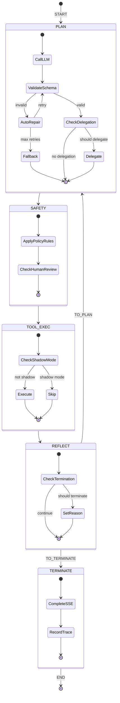

# 04 - State Machine

> Deep dive into the LangGraph4j state machine implementation.

---

## Table of Contents

1. [What Is LangGraph4j?](#1-what-is-langgraph4j)
2. [Graph Structure](#2-graph-structure)
3. [State Definition](#3-state-definition)
4. [Node Implementations](#4-node-implementations)
5. [Edge Routing](#5-edge-routing)
6. [Termination Conditions](#6-termination-conditions)
7. [State Diagram](#7-state-diagram)
8. [Why This Design?](#8-why-this-design)

---

## 1. What Is LangGraph4j?

### Overview

LangGraph4j is a Java port of LangGraph (Python), designed for building stateful, multi-actor applications with LLMs.

```
┌─────────────────────────────────────────────────────────────────┐
│                    LANGGRAPH4J CORE CONCEPTS                    │
├─────────────────────────────────────────────────────────────────┤
│                                                                 │
│   Graph                                                         │
│   ─────                                                         │
│   A directed graph with nodes (functions) and edges (flows)     │
│                                                                 │
│           ┌─────────┐     ┌─────────┐     ┌─────────┐           │
│           │ Node A  │ ──→ │ Node B  │ ──→ │ Node C  │           │
│           └─────────┘     └─────────┘     └─────────┘           │
│                                                                 │
│   State                                                         │
│   ─────                                                         │
│   A shared state object passed between nodes                    │
│   Nodes can read and write to state                             │
│                                                                 │
│   Edges                                                         │
│   ─────                                                         │
│   Normal edges: Always go from A to B                           │
│   Conditional edges: Route based on state                       │
│                                                                 │
│           ┌─────────┐                     ┌─────────┐           │
│           │ Node A  │ ──── condition ───→ │ Node B  │           │
│           │         │          │          └─────────┘           │
│           │         │          │          ┌─────────┐           │
│           │         │          └────────→ │ Node C  │           │
│           └─────────┘                     └─────────┘           │
│                                                                 │
└─────────────────────────────────────────────────────────────────┘
```

### Why LangGraph4j vs Custom?

```
┌─────────────────────────────────────────────────────────────────┐
│                           COMPARISON                            │
├─────────────────────────────────────────────────────────────────┤
│                                                                 │
│   Custom State Machine:                                         │
│   ─────────────────────                                         │
│   + Full control                                                │
│   - Lots of boilerplate                                         │
│   - No built-in state management                                │
│   - No visualization tools                                      │
│   - Manual iteration control                                    │
│   - Hard to debug                                               │
│                                                                 │
│   Spring State Machine:                                         │
│   ─────────────────────                                         │
│   + Spring integration                                          │
│   + Visualization tools                                         │
│   - Heavy configuration                                         │
│   - Not designed for AI workflows                               │
│   - Complex persistence                                         │
│                                                                 │
│   LangGraph4j:                                                  │
│   ────────────                                                  │
│   + Purpose-built for AI agents                                 │
│   + Simple API (nodes + edges)                                  │
│   + Built-in state management                                   │
│   + Conditional routing built-in                                │
│   + Max iteration safety                                        │
│   + Matches Python LangGraph patterns                           │
│   - Less mature (Java port)                                     │
│                                                                 │
└─────────────────────────────────────────────────────────────────┘
```

---

## 2. Graph Structure

### Graph Definition

```
┌─────────────────────────────────────────────────────────────────┐
│                       GRAPH ARCHITECTURE                        │
├─────────────────────────────────────────────────────────────────┤
│                                                                 │
│   Nodes (5):                                                    │
│   ┌─────────────────────────────────────────────────────────┐   │
│   │                                                         │   │
│   │   PLAN          - LLM decides routing                   │   │
│   │   SAFETY        - Apply policy gates                    │   │
│   │   TOOL_EXEC     - Execute actions                       │   │
│   │   REFLECT       - Decide continue vs terminate          │   │
│   │   TERMINATE     - Finalize and return                   │   │
│   │                                                         │   │
│   └─────────────────────────────────────────────────────────┘   │
│                                                                 │
│   Normal Edges (4):                                             │
│   ┌─────────────────────────────────────────────────────────┐   │
│   │                                                         │   │
│   │   START ─────────→ PLAN                                 │   │
│   │   PLAN ──────────→ SAFETY                               │   │
│   │   SAFETY ────────→ TOOL_EXEC                            │   │
│   │   TOOL_EXEC ─────→ REFLECT                              │   │
│   │                                                         │   │
│   └─────────────────────────────────────────────────────────┘   │
│                                                                 │
│   Conditional Edges (1):                                        │
│   ┌─────────────────────────────────────────────────────────┐   │
│   │                                                         │   │
│   │   REFLECT ─── condition ───→ TO_PLAN (loop)             │   │
│   │             │                                           │   │
│   │             └────────────→ TO_TERMINATE (end)           │   │
│   │                                                         │   │
│   └─────────────────────────────────────────────────────────┘   │
│                                                                 │
│   End Edge:                                                     │
│   ┌─────────────────────────────────────────────────────────┐   │
│   │                                                         │   │
│   │   TERMINATE ─────→ END                                  │   │
│   │                                                         │   │
│   └─────────────────────────────────────────────────────────┘   │
│                                                                 │
└─────────────────────────────────────────────────────────────────┘
```

### Visual Graph

```
                              START
                                │
                                ▼
┌─────────────────────────────────────────────────────────────────────┐
│                                                                     │
│   ┌───────────────────────────────────────────────────────────────┐ │
│   │                                                               │ │
│   │    ┌─────────┐         ┌─────────┐         ┌─────────────┐    │ │
│   │    │  PLAN   │ ──────→ │ SAFETY  │ ──────→ │  TOOL_EXEC  │    │ │
│   │    │         │         │         │         │             │    │ │
│   │    │ • LLM   │         │ • Policy│         │ • Execute   │    │ │
│   │    │ • Decide│         │   Gates │         │   action    │    │ │
│   │    │         │         │         │         │             │    │ │
│   │    └─────────┘         └─────────┘         └─────────────┘    │ │
│   │                                                  │            │ │
│   │                                                  │            │ │
│   │                                                  ▼            │ │
│   │                                           ┌─────────────┐     │ │
│   │                                           │  REFLECT    │     │ │
│   │                                           │             │     │ │
│   │                                           │ • Continue? │     │ │
│   │                                           │ • Terminate?│     │ │
│   │                                           └──────┬──────┘     │ │
│   │                                                  │            │ │
│   └──────────────────────────────────────────────────┼────────────┘ │
│                                                      │              │
│                           ┌──────────────────────────┤              │
│                           │                          │              │
│                           │                          ▼              │
│                    ┌──────┴──────┐           ┌─────────────┐        │
│                    │   TO_PLAN   │           │ TO_TERMINATE│        │
│                    │             │           │             │        │
│                    │ Loop back   │           │ End         │        │
│                    │             │           │             │        │
│                    └──────┬──────┘           └──────┬──────┘        │
│                           │                         │               │
│                           │                         │               │
│                           ▼                         ▼               │
│                    ┌─────────────┐           ┌─────────────┐        │
│                    │    PLAN     │           │  TERMINATE  │        │
│                    │ (next step) │           │             │        │
│                    └─────────────┘           │ • Finalize  │        │
│                                              │ • Return    │        │
│                                              └──────┬──────┘        │
│                                                     │               │
│                                                     ▼               │
│                                                    END              │
│                                                                     │
└─────────────────────────────────────────────────────────────────────┘
```

---

## 3. State Definition

### AgentGraphState

The state object that travels through the graph:

```
┌─────────────────────────────────────────────────────────────────┐
│                    AgentGraphState                              │
├─────────────────────────────────────────────────────────────────┤
│                                                                 │
│   Identifiers                                                   │
│   ───────────                                                   │
│   ticketId: Long              // Which ticket is being routed   │
│   runtimeRunId: Long          // Current run trace ID           │
│   routerRequest: RouterRequest // Enriched input context        │
│   startedAt: Instant          // When this run started          │
│                                                                 │
│   Planning State                                                │
│   ──────────────                                                │
│   plannerRawJson: String       // Raw LLM response              │
│   plannedResponse: RouterResponse // Parsed LLM decision        │
│   fallbackUsed: boolean        // Did we use fallback?          │
│   errorCode: Enum              // If error, what kind?          │
│   errorMessage: String         // Human-readable error          │
│                                                                 │
│   Execution State                                               │
│   ────────────────                                              │
│   safetyDecision: AgentSafetyDecision // Policy evaluation      │
│   toolExecutionResult: AgentToolExecutionResult // Action result│
│   finalResponse: RouterResponse // The final routing decision   │
│                                                                 │
│   Multi-Agent State                                             │
│   ─────────────────                                             │
│   actorRole: AgentRole         // Who is acting now             │
│   targetRole: AgentRole        // Who to delegate to            │
│   handoff: boolean             // Is this a delegation?         │
│   handoffReason: String        // Why delegate?                 │
│                                                                 │
│   Control State                                                 │
│   ──────────────                                                │
│   stepCount: int               // How many steps completed      │
│   decisions: List<AgentStepDecision> // Decision history        │
│   terminationReason: AgentTerminationReason // Why ended        │
│                                                                 │
└─────────────────────────────────────────────────────────────────┘
```

### State Flow Through Nodes

```
┌─────────────────────────────────────────────────────────────────┐
│                    STATE MUTATIONS                              │
├─────────────────────────────────────────────────────────────────┤
│                                                                 │
│   PLAN Node:                                                    │
│   ──────────                                                    │
│   READS: routerRequest, ticketId                                │
│   WRITES: plannerRawJson, plannedResponse, fallbackUsed,        │
│           errorCode, errorMessage, actorRole, targetRole,       │
│           handoff, handoffReason                                │
│                                                                 │
│   SAFETY Node:                                                  │
│   ────────────                                                  │
│   READS: plannedResponse                                        │
│   WRITES: safetyDecision, finalResponse                         │
│           (also: recordDecision() increments stepCount)         │
│                                                                 │
│   TOOL_EXEC Node:                                               │
│   ───────────────                                               │
│   READS: finalResponse                                          │
│   WRITES: toolExecutionResult                                   │
│                                                                 │
│   REFLECT Node:                                                 │
│   ─────────────                                                 │
│   READS: finalResponse, safetyDecision, stepCount               │
│   WRITES: terminationReason (if terminating)                    │
│           (returns: nextRoute = TO_PLAN | TO_TERMINATE)         │
│                                                                 │
│   TERMINATE Node:                                               │
│   ──────────────                                                │
│   READS: finalResponse, safetyDecision, toolExecutionResult     │
│   WRITES: (none - just finalizes trace)                         │
│                                                                 │
└─────────────────────────────────────────────────────────────────┘
```

---

## 4. Node Implementations

### PLAN Node

```
┌─────────────────────────────────────────────────────────────────┐
│                            PLAN NODE                            │
├─────────────────────────────────────────────────────────────────┤
│                                                                 │
│   Purpose: Get routing decision from LLM                        │
│                                                                 │
│   Steps:                                                        │
│   ┌─────────────────────────────────────────────────────────┐   │
│   │                                                         │   │
│   │   1. Call AgentPlannerClient.decide(request, ticketId)  │   │
│   │                                                         │   │
│   │   2. Validate JSON schema:                              │   │
│   │      if (!valid && repairEnabled && retries < max) {    │   │
│   │          json = llm.repairPlan(json, errorMessage);     │   │
│   │          retries++;                                     │   │
│   │      }                                                  │   │
│   │                                                         │   │
│   │   3. If still invalid:                                  │   │
│   │      response = fallbackService.humanReviewFallback()   │   │
│   │                                                         │   │
│   │   4. Check for multi-agent delegation:                  │   │
│   │      if (shouldDelegate(decision)) {                    │   │
│   │          decision = llm.decideForRole(role);            │   │
│   │          setHandoff(true);                              │   │
│   │      }                                                  │   │
│   │                                                         │   │
│   │   5. Validate contract:                                 │   │
│   │      contractValidator.validate(response);              │   │
│   │                                                         │   │
│   │   6. Store in state:                                    │   │
│   │      state.setPlannedResponse(response);                │   │
│   │      state.setPlannerRawJson(rawJson);                  │   │
│   │                                                         │   │
│   │   7. Record trace:                                      │   │
│   │      traceService.recordStep(...);                      │   │
│   │                                                         │   │
│   └─────────────────────────────────────────────────────────┘   │
│                                                                 │
│   Outputs:                                                      │
│   ┌─────────────────────────────────────────────────────────┐   │
│   │   plannedResponse: RouterResponse                       │   │
│   │   plannerRawJson: String                                │   │
│   │   fallbackUsed: boolean                                 │   │
│   │   nextRoute: TO_SAFETY                                  │   │
│   └─────────────────────────────────────────────────────────┘   │
│                                                                 │
└─────────────────────────────────────────────────────────────────┘
```

### SAFETY Node

```
┌─────────────────────────────────────────────────────────────────┐
│                           SAFETY NODE                           │
├─────────────────────────────────────────────────────────────────┤
│                                                                 │
│   Purpose: Apply policy gates to LLM decision                   │
│                                                                 │
│   Steps:                                                        │
│   ┌─────────────────────────────────────────────────────────┐   │
│   │                                                         │   │
│   │   1. Get planned response:                              │   │
│   │      response = state.getPlannedResponse();             │   │
│   │                                                         │   │
│   │   2. Evaluate safety:                                   │   │
│   │      safetyDecision = safetyEvaluator.evaluate(response)│   │
│   │                                                         │   │
│   │   3. Safety evaluation applies policy rules:            │   │
│   │      ┌─────────────────────────────────────────────┐    │   │
│   │      │ for (rule : policyRules) {                  │    │   │
│   │      │     result = rule.apply(response);          │    │   │
│   │      │     if (result.changed()) {                 │    │   │
│   │      │         response = result.response();       │    │   │
│   │      │     }                                       │    │   │
│   │      │ }                                           │    │   │
│   │      └─────────────────────────────────────────────┘    │   │
│   │                                                         │   │
│   │   4. Check for human review requirement:                │   │
│   │      if (action.requiresHumanIntervention()) {          │   │
│   │          status = REQUIRES_HUMAN_REVIEW;                │   │
│   │      }                                                  │   │
│   │                                                         │   │
│   │   5. Persist routing decision:                          │   │
│   │      persistenceService.applyRoutingDecision(           │   │
│   │          ticket, safeResponse                           │   │
│   │      );                                                 │   │
│   │                                                         │   │
│   │   6. Store in state:                                    │   │
│   │      state.setSafetyDecision(safetyDecision);           │   │
│   │      state.setFinalResponse(safeResponse);              │   │
│   │      state.recordDecision(safeResponse); // stepCount++ │   │
│   │                                                         │   │
│   └─────────────────────────────────────────────────────────┘   │
│                                                                 │
│   Outputs:                                                      │
│   ┌─────────────────────────────────────────────────────────┐   │
│   │   safetyDecision: AgentSafetyDecision                   │   │
│   │   finalResponse: RouterResponse (possibly modified)     │   │
│   │   stepCount: incremented                                │   │
│   │   nextRoute: TO_TOOL_EXEC                               │   │
│   └─────────────────────────────────────────────────────────┘   │
│                                                                 │
└─────────────────────────────────────────────────────────────────┘
```

### TOOL_EXEC Node

```
┌─────────────────────────────────────────────────────────────────┐
│                         TOOL_EXEC NODE                          │
├─────────────────────────────────────────────────────────────────┤
│                                                                 │
│   Purpose: Execute the decided action                           │
│                                                                 │
│   Steps:                                                        │
│   ┌─────────────────────────────────────────────────────────┐   │
│   │                                                         │   │
│   │   1. Get safe response:                                 │   │
│   │      response = state.getFinalResponse();               │   │
│   │                                                         │   │
│   │   2. Check shadow mode:                                 │   │
│   │      if (!shadowMode) {                                 │   │
│   │          toolExecutor.execute(ticket, response);        │   │
│   │          result = AgentToolExecutionResult.executed();  │   │
│   │      } else {                                           │   │
│   │          result = AgentToolExecutionResult.skipped();   │   │
│   │      }                                                  │   │
│   │                                                         │   │
│   │   3. Tool execution dispatches by action:               │   │
│   │      switch (nextAction) {                              │   │
│   │        AUTO_REPLY     -> tools.autoReply(draft)         │   │
│   │        ASK_CLARIFYING -> tools.askClarifying(question)  │   │
│   │        ASSIGN_QUEUE   -> tools.assignQueue(queue)       │   │
│   │        ESCALATE       -> tools.escalate(note)           │   │
│   │        HUMAN_REVIEW   -> tools.markHumanReview(note)    │   │
│   │        ...                                              │   │
│   │      }                                                  │   │
│   │                                                         │   │
│   │   4. Store in state:                                    │   │
│   │      state.setToolExecutionResult(result);              │   │
│   │                                                         │   │
│   └─────────────────────────────────────────────────────────┘   │
│                                                                 │
│   Outputs:                                                      │
│   ┌─────────────────────────────────────────────────────────┐   │
│   │   toolExecutionResult: AgentToolExecutionResult         │   │
│   │   nextRoute: TO_REFLECT                                 │   │
│   └─────────────────────────────────────────────────────────┘   │
│                                                                 │
└─────────────────────────────────────────────────────────────────┘
```

### REFLECT Node

```
┌─────────────────────────────────────────────────────────────────┐
│                          REFLECT NODE                           │
├─────────────────────────────────────────────────────────────────┤
│                                                                 │
│   Purpose: Decide whether to continue or terminate              │
│                                                                 │
│   Steps:                                                        │
│   ┌─────────────────────────────────────────────────────────┐   │
│   │                                                         │   │
│   │   1. Get current state:                                 │   │
│   │      response = state.getFinalResponse();               │   │
│   │      safety = state.getSafetyDecision();                │   │
│   │      stepCount = state.getStepCount();                  │   │
│   │                                                         │   │
│   │   2. Check termination conditions:                      │   │
│   │                                                         │   │
│   │      ┌────────────────────────────────────────────────┐ │   │
│   │      │ Condition 1: Policy reached                    │ │   │
│   │      │   stepCount >= maxSteps                        │ │   │
│   │      │   OR elapsedMs >= maxRuntimeMs                 │ │   │
│   │      │                                                │ │   │
│   │      │ Condition 2: Needs review                      │ │   │
│   │      │   safety.status == REQUIRES_HUMAN_REVIEW       │ │   │
│   │      │                                                │ │   │
│   │      │ Condition 3: Action blocked                    │ │   │
│   │      │   response.nextAction.requiresHumanIntervention│ │   │
│   │      │                                                │ │   │
│   │      │ Condition 4: Goal reached                      │ │   │
│   │      │   stepCount > 0 (action completed)             │ │   │
│   │      └────────────────────────────────────────────────┘ │   │
│   │                                                         │   │
│   │   3. Determine next route:                              │   │
│   │      if (any condition met) {                           │   │
│   │          nextRoute = TO_TERMINATE;                      │   │
│   │          setTerminationReason(...);                     │   │
│   │      } else {                                           │   │
│   │          nextRoute = TO_PLAN; // Loop again             │   │
│   │      }                                                  │   │
│   │                                                         │   │
│   │   4. Record trace:                                      │   │
│   │      traceService.recordStep(...);                      │   │
│   │                                                         │   │
│   └─────────────────────────────────────────────────────────┘   │
│                                                                 │
│   Outputs:                                                      │
│   ┌─────────────────────────────────────────────────────────┐   │
│   │   terminated: boolean                                   │   │
│   │   terminationReason: AgentTerminationReason (if ending) │   │
│   │   nextRoute: TO_PLAN | TO_TERMINATE                     │   │
│   └─────────────────────────────────────────────────────────┘   │
│                                                                 │
└─────────────────────────────────────────────────────────────────┘
```

### TERMINATE Node

```
┌─────────────────────────────────────────────────────────────────┐
│                         TERMINATE NODE                          │
├─────────────────────────────────────────────────────────────────┤
│                                                                 │
│   Purpose: Finalize and return result                           │
│                                                                 │
│   Steps:                                                        │
│   ┌─────────────────────────────────────────────────────────┐   │
│   │                                                         │   │
│   │   1. Complete SSE channel:                              │   │
│   │      sseEngine.complete(channel, ticketId, event);      │   │
│   │                                                         │   │
│   │   2. Record final trace:                                │   │
│   │      traceService.recordStep(stepType=TERMINATE, ...);  │   │
│   │                                                         │   │
│   │   3. Return (implicitly):                               │   │
│   │      // Graph execution ends                            │   │
│   │      // finalResponse is available to caller            │   │
│   │                                                         │   │
│   └─────────────────────────────────────────────────────────┘   │
│                                                                 │
│   Outputs:                                                      │
│   ┌─────────────────────────────────────────────────────────┐   │
│   │   (No state changes - finalization only)                │   │
│   │   Returns: state.getFinalResponse() to caller           │   │
│   └─────────────────────────────────────────────────────────┘   │
│                                                                 │
└─────────────────────────────────────────────────────────────────┘
```

---

## 5. Edge Routing

### Normal vs Conditional Edges

```
┌─────────────────────────────────────────────────────────────────┐
│                           EDGE TYPES                            │
├─────────────────────────────────────────────────────────────────┤
│                                                                 │
│   Normal Edges (Unconditional)                                  │
│   ────────────────────────────                                  │
│                                                                 │
│   stateGraph.addEdge(fromNode, toNode)                          │
│                                                                 │
│   Always transitions from A to B:                               │
│                                                                 │
│       ┌─────────┐     ┌─────────┐     ┌─────────┐               │
│       │  PLAN   │ ──→ │ SAFETY  │ ──→ │TOOL_EXEC│               │
│       └─────────┘     └─────────┘     └─────────┘               │
│                                                                 │
│   These ALWAYS execute in this order.                           │
│                                                                 │
├─────────────────────────────────────────────────────────────────┤
│                                                                 │
│   Conditional Edges                                             │
│   ─────────────────                                             │
│                                                                 │
│   stateGraph.addConditionalEdges(                               │
│       fromNode,                                                 │
│       state -> determineNextRoute(state),  // Routing function  │
│       Map.of(                                                   │
│           "TO_PLAN", planNode,                                  │
│           "TO_TERMINATE", terminateNode                         │
│       )                                                         │
│   )                                                             │
│                                                                 │
│   Routes based on state:                                        │
│                                                                 │
│                         ┌─────────┐                             │
│                         │ REFLECT │                             │
│                         └────┬────┘                             │
│                              │                                  │
│                     ┌────────┴────────┐                         │
│                     │ condition(state)│                         │
│                     └────────┬────────┘                         │
│                     ┌────────┴────────┐                         │
│                     │                 │                         │
│                     ▼                 ▼                         │
│               ┌─────────┐       ┌───────────┐                   │
│               │  PLAN   │       │ TERMINATE │                   │
│               │ (loop)  │       │   (end)   │                   │
│               └─────────┘       └───────────┘                   │
│                                                                 │
└─────────────────────────────────────────────────────────────────┘
```

### Routing Logic

```
┌─────────────────────────────────────────────────────────────────┐
│                    REFLECT ROUTING LOGIC                        │
├─────────────────────────────────────────────────────────────────┤
│                                                                 │
│   nextRoute(state):                                             │
│                                                                 │
│   ┌─────────────────────────────────────────────────────────┐   │
│   │                                                         │   │
│   │   // Check termination conditions                       │   │
│   │   isPolicyReached = terminationPolicy.shouldTerminate() │   │
│   │   needsReview = safetyDecision.status.requiresReview()  │   │
│   │   actionBlocked = response.nextAction.requiresHuman()   │   │
│   │   hasCompleted = stepCount > 0                          │   │
│   │                                                         │   │
│   │   shouldTerminate = isPolicyReached                     │   │
│   │                   || needsReview                        │   │
│   │                   || actionBlocked                      │   │
│   │                   || hasCompleted                       │   │
│   │                                                         │   │
│   │   if (shouldTerminate) {                                │   │
│   │       return TO_TERMINATE                               │   │
│   │   }                                                     │   │
│   │                                                         │   │
│   │   return TO_PLAN  // Loop again                         │   │
│   │                                                         │   │
│   └─────────────────────────────────────────────────────────┘   │
│                                                                 │
└─────────────────────────────────────────────────────────────────┘
```

---

## 6. Termination Conditions

### All Termination Reasons

```
┌─────────────────────────────────────────────────────────────────┐
│                    TERMINATION REASONS                          │
├─────────────────────────────────────────────────────────────────┤
│                                                                 │
│   GOAL_REACHED                                                  │
│   ─────────────                                                 │
│   When: Action completed successfully (stepCount > 0)           │
│   Meaning: The routing decision was made and executed           │
│                                                                 │
│   SAFETY_BLOCKED                                                │
│   ──────────────                                                │
│   When: Policy engine determined human review needed            │
│   Meaning: LLM decision overridden, requires human attention    │
│                                                                 │
│   BUDGET_EXCEEDED                                               │
│   ──────────────                                                │
│   When: stepCount >= maxSteps OR elapsedMs >= maxRuntimeMs      │
│   Meaning: Ran out of time or steps before completing           │
│                                                                 │
│   PLAN_VALIDATION_FAILED                                        │
│   ────────────────────────                                      │
│   When: LLM output couldn't be repaired after retries           │
│   Meaning: Fallback used, human review required                 │
│                                                                 │
└─────────────────────────────────────────────────────────────────┘
```

### Termination Decision Tree

```
                              REFLECT
                                 │
                                 ▼
              ┌──────────────────────────────────┐
              │ fallbackUsed?                    │
              └────────────────┬─────────────────┘
                               │
               ┌───────────────┴───────────────┐
               │                               │
              YES                             NO
               │                               │
               ▼                               ▼
    ┌──────────────────┐         ┌────────────────────────┐
    │ PLAN_VALIDATION  │         │ safety.status          │
    │ _FAILED          │         │ == REQUIRES_HUMAN_     │
    └──────────────────┘         │ REVIEW?                │
                                 └───────────┬────────────┘
                                             │
                             ┌───────────────┴───────────────┐
                             │                               │
                            YES                             NO
                             │                               │
                             ▼                               ▼
                  ┌──────────────────┐    ┌────────────────────────┐
                  │ SAFETY_BLOCKED   │    │ terminationPolicy      │
                  └──────────────────┘    │ .shouldTerminate()?    │
                                          └───────────┬────────────┘
                                                      │
                                      ┌───────────────┴───────────────┐
                                      │                               │
                                     YES                             NO
                                      │                               │
                                      ▼                               ▼
                           ┌──────────────────┐    ┌────────────────────────┐
                           │ BUDGET_EXCEEDED  │    │ stepCount > 0?         │
                           └──────────────────┘    └───────────┬────────────┘
                                                               │
                                               ┌───────────────┴───────────────┐
                                               │                               │
                                              YES                             NO
                                               │                               │
                                               ▼                               ▼
                                        ┌──────────────────┐       ┌──────────────┐
                                        │ GOAL_REACHED     │       │ TO_PLAN      │
                                        │ (TERMINATE)      │       │ (CONTINUE)   │
                                        └──────────────────┘       └──────────────┘
```

---

## 7. State Diagram

### Mermaid State Diagram



---

## 8. Why This Design?

### Design Rationale

```
┌─────────────────────────────────────────────────────────────────┐
│                    DESIGN DECISIONS                             │
├─────────────────────────────────────────────────────────────────┤
│                                                                 │
│   Why PLAN → SAFETY → TOOL_EXEC → REFLECT order?                │
│   ─────────────────────────────────────────────────             │
│                                                                 │
│   1. PLAN first: We need a decision before we can validate      │
│   2. SAFETY before TOOL_EXEC: Validate BEFORE executing         │
│   3. TOOL_EXEC after SAFETY: Only execute safe decisions        │
│   4. REFLECT at end: Evaluate result before deciding next       │
│                                                                 │
│   Why allow looping?                                            │
│   ──────────────────                                            │
│                                                                 │
│   • Multi-step reasoning sometimes needed                       │
│   • Example: Ask question → get answer → make decision          │
│   • Future: Tool results might change plan                      │
│   • Safety: Termination conditions prevent infinite loops       │
│                                                                 │
│   Why SAFETY as separate node?                                  │
│   ──────────────────────────────                                │
│                                                                 │
│   • Separation of concerns (planning vs validation)             │
│   • Easy to add/modify rules without touching planner           │
│   • Clear audit trail of policy decisions                       │
│   • Can trace which rule triggered override                     │
│                                                                 │
│   Why TERMINATE as separate node?                               │
│   ───────────────────────────────                               │
│                                                                 │
│   • Cleanup tasks (SSE completion, final trace)                 │
│   • Consistent end point for observability                      │
│   • Future: Could add notification hooks                        │
│                                                                 │
│   Why max iteration limit?                                      │
│   ─────────────────────                                         │
│                                                                 │
│   graph.setMaxIterations(maxSteps * 8)                          │
│                                                                 │
│   • Prevents runaway state machines                             │
│   • Safety net even if REFLECT logic has bugs                   │
│   • Multiple iterations per step for edge cases                 │
│                                                                 │
└─────────────────────────────────────────────────────────────────┘
```

---

## Navigation

**Previous:** [03 - Routing Flow](./03-routing-flow.md)  
**Next:** [05 - Multi-Agent Orchestration](./05-multi-agent.md)
