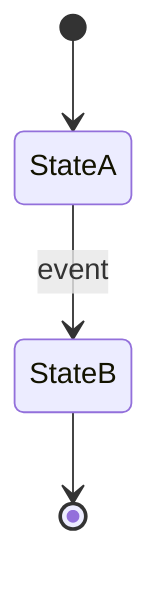
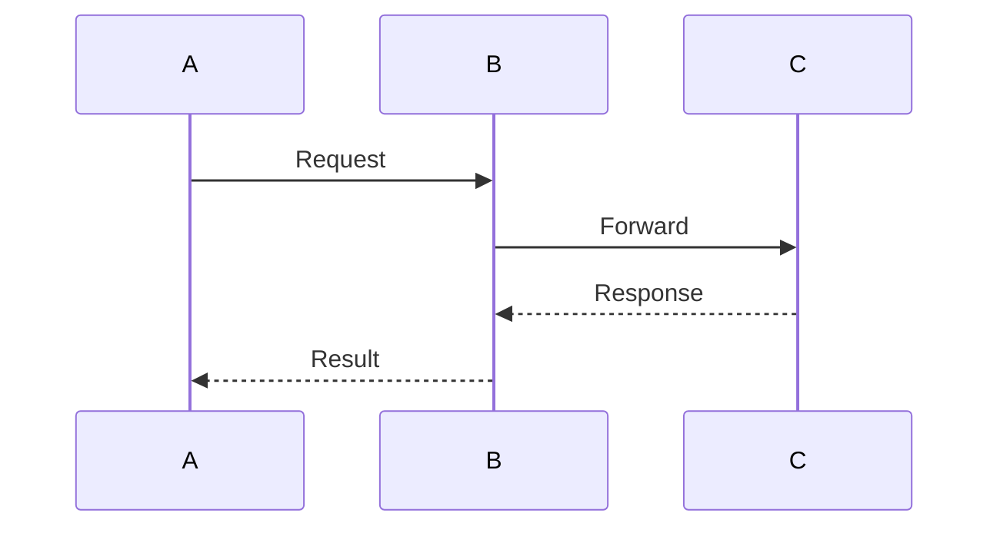

# Agentic Ticket Router: Documentation Index

> A comprehensive guide to the AI-powered ticket routing system using LangGraph4j, multi-agent orchestration, and
> policy-based guardrails.

---

## Overview

This documentation provides a complete technical reference for understanding, teaching, and operating the Agentic Ticket
Router system. It covers everything from high-level architecture to low-level implementation details, troubleshooting,
and performance tuning.

## Who Is This For?

| Audience               | Recommended Sections                    |
|------------------------|-----------------------------------------|
| **Software Engineers** | All sections, especially 04-08          |
| **DevOps/SRE**         | 09, 10, 11, 12                          |
| **Technical Leads**    | 01, 02, 12                              |
| **ML Engineers**       | 04, 05, 11                              |
| **Instructors**        | All sections + teaching checklist in 01 |

---

## Documentation Structure

### Part 1: Understanding the System

| Document                                    | Description                               | Key Topics                                                               |
|---------------------------------------------|-------------------------------------------|--------------------------------------------------------------------------|
| [01 - Overview](./01-overview.md)           | Executive summary and system introduction | What makes it "agentic", tech stack, comparison with traditional systems |
| [02 - Architecture](./02-architecture.md)   | System architecture and design decisions  | C4 diagrams, component overview, ADRs                                    |
| [03 - Routing Flow](./03-routing-flow.md)   | End-to-end routing process                | Sequence diagrams, step-by-step flow                                     |
| [04 - State Machine](./04-state-machine.md) | LangGraph4j implementation                | Graph structure, nodes, edges, state                                     |

### Part 2: Core Subsystems

| Document                                              | Description                      | Key Topics                                        |
|-------------------------------------------------------|----------------------------------|---------------------------------------------------|
| [05 - Multi-Agent Orchestration](./05-multi-agent.md) | Supervisor-specialist delegation | Agent roles, delegation flow, orchestration modes |
| [06 - Policy Engine](./06-policy-engine.md)           | Guardrails and safety rules      | Rule structure, built-in rules, adding new rules  |
| [07 - Resilience](./07-resilience.md)                 | Error handling and fallbacks     | Circuit breaker, retry, fallback responses        |
| [08 - Observability](./08-observability.md)           | Monitoring and tracing           | Run tracking, SSE streaming, logging              |

### Part 3: Operations

| Document                                                  | Description             | Key Topics                                  |
|-----------------------------------------------------------|-------------------------|---------------------------------------------|
| [09 - Configuration](./09-configuration.md)               | Configuration reference | All config options, modes, anti-patterns    |
| [10 - Troubleshooting](./10-troubleshooting.md)           | Debugging guide         | Common issues, error codes, debugging tools |
| [11 - Performance Tuning](./11-performance-tuning.md)     | Optimization guide      | LLM, database, caching, concurrency         |
| [12 - Production Checklist](./12-production-checklist.md) | Deployment guide        | Pre-launch checklist, monitoring setup      |

---

## Quick Start Guide

### For Learning

1. Read [01 - Overview](./01-overview.md) to understand the big picture
2. Study [02 - Architecture](./02-architecture.md) for system design
3. Walk through [03 - Routing Flow](./03-routing-flow.md) with a real ticket
4. Dive deep into [04 - State Machine](./04-state-machine.md) for agentic patterns

### For Debugging

1. Check [10 - Troubleshooting](./10-troubleshooting.md) for your issue
2. Use error code reference to identify the problem
3. Apply the suggested solution
4. Review [08 - Observability](./08-observability.md) for deeper investigation

### For Optimization

1. Identify bottleneck in [08 - Observability](./08-observability.md)
2. Apply relevant tuning from [11 - Performance Tuning](./11-performance-tuning.md)
3. Validate improvement with metrics
4. Update configuration in [09 - Configuration](./09-configuration.md)

### For Production

1. Complete all items in [12 - Production Checklist](./12-production-checklist.md)
2. Configure alerting based on [08 - Observability](./08-observability.md)
3. Set up runbooks from [10 - Troubleshooting](./10-troubleshooting.md)
4. Document any custom configurations in [09 - Configuration](./09-configuration.md)

---

## Key Concepts at a Glance

### What Makes It "Agentic"?

```
Traditional LLM App          vs          Agentic System
─────────────────────────                ─────────────────────────
Single prompt → response                 Multi-step state machine
No memory                                State persists across steps
No validation                            Schema validation + repair
No guardrails                            Policy engine with rules
No actions                               Tool execution layer
No observability                         Full run/step tracing
Single agent                             Multi-agent delegation
No limits                                Step, time, action budgets
```

### The Core Loop

```
┌─────────────────────────────────────────────────────────────┐
│                                                             │
│    ┌───────┐      ┌────────┐      ┌──────────────┐          │
│    │ PLAN  │ ──→  │ SAFETY │ ──→  │ TOOL_EXEC    │          │
│    └───────┘      └────────┘      └──────────────┘          │
│         ↑                               │                   │
│         │                               ↓                   │
│         │                         ┌───────────┐             │
│         └─────────────────────────│  REFLECT  │             │
│              (if more needed)     └─────┬─────┘             │
│                                         │                   │
│                                    ┌────↓────┐              │
│                                    │TERMINATE│              │
│                                    └─────────┘              │
│                                                             │
└─────────────────────────────────────────────────────────────┘
```

### Technology Stack

| Layer           | Technology   | Purpose                               |
|-----------------|--------------|---------------------------------------|
| State Machine   | LangGraph4j  | Orchestration of multi-step reasoning |
| LLM Integration | Spring AI    | Ollama/OpenAI integration             |
| Vector Store    | pgvector     | RAG for knowledge articles            |
| Resilience      | Resilience4j | Circuit breaker, retry                |
| Real-time       | SSE          | Progress streaming to frontend        |
| Database        | PostgreSQL   | Persistence, JSONB, vectors           |
| Framework       | Spring Boot  | Dependency injection, transactions    |

---

## Diagram Legend

Throughout this documentation, we use several types of diagrams:

### Flow Diagrams

```
┌─────────┐     ┌─────────┐     ┌─────────┐
│   A     │ ──→ │   B     │ ──→ │   C     │
└─────────┘     └─────────┘     └─────────┘
```

### Decision Points

```
              ┌───── Yes ────→ [Action A]
              │
┌─────────┐   │
│Condition│ ──┤
└─────────┘   │
              │
              └───── No ─────→ [Action B]
```

### State Transitions



### Sequence Diagrams



---

## Version History

| Version | Date    | Changes                             |
|---------|---------|-------------------------------------|
| 1.0     | Current | Initial comprehensive documentation |

---

## Contributing

When adding new features or modifying existing ones:

1. Update relevant documentation section
2. Add new error codes to troubleshooting guide
3. Document any new configuration options
4. Update diagrams if flow changes

---

## Getting Help

1. Check the [Troubleshooting Guide](./10-troubleshooting.md)
2. Search logs for error codes
3. Review observability dashboards
4. Consult the [Configuration Reference](./09-configuration.md)
